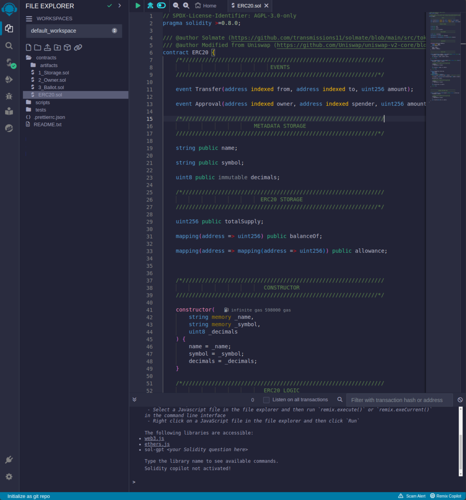
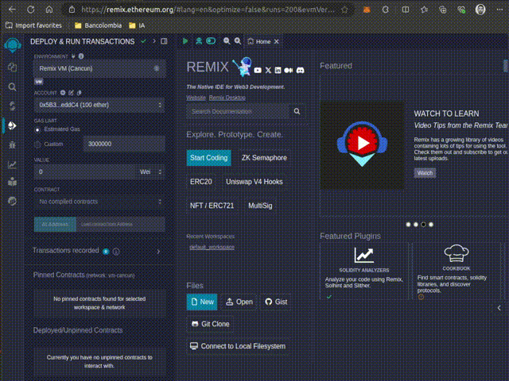
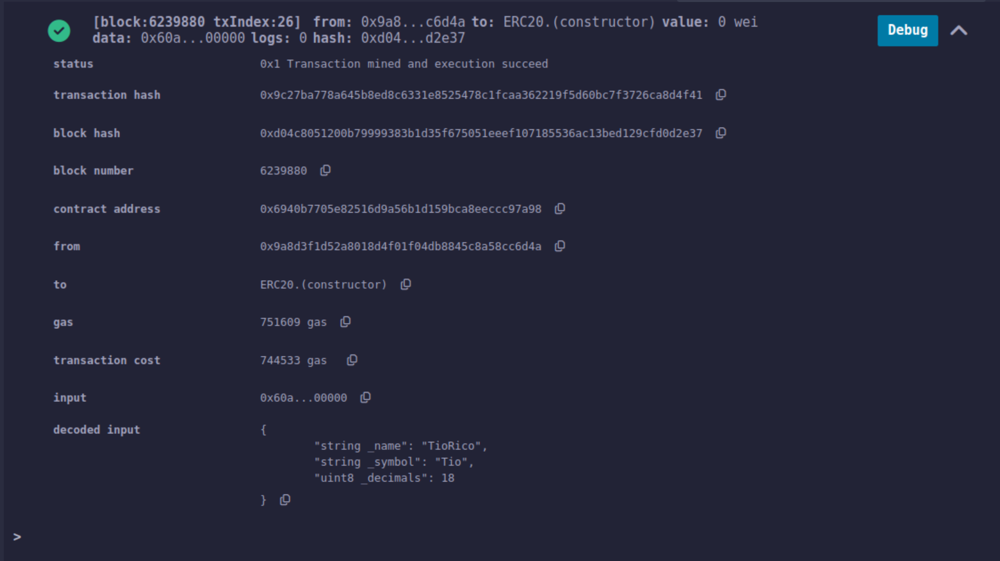
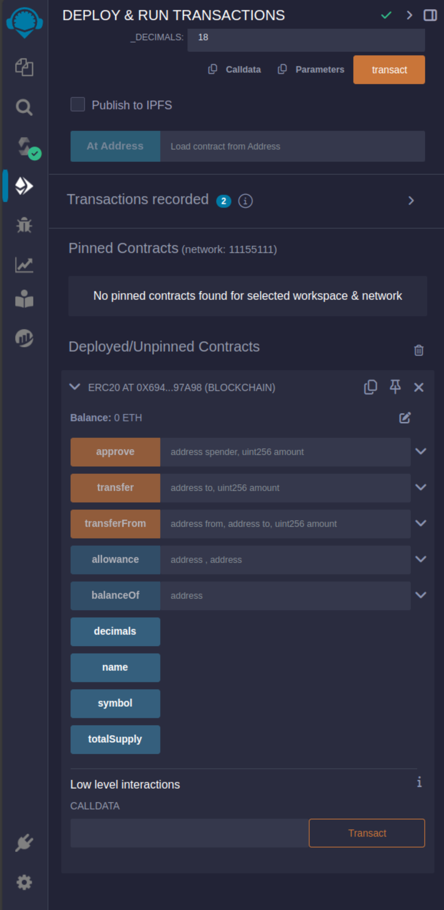

# Despliegue de un Token ERC20 en Sepolia usando Remix

## Pasos:

1. Abre [Remix IDE](https://remix.ethereum.org/) en tu navegador.

2. Crea un nuevo archivo para tu contrato ERC20.

    

3. Escribe o copia el código de tu token ERC20 en el archivo.
    
    

4. Compila el contrato en Remix (Este paso la herramientas lo hace de manera autamatica al guardar los cambios, `ctrl + s`).

5. En la pestaña "Deploy & Run Transactions", selecciona "Injected Provider - MetaMask" en el menú desplegable de "Environment".

6. Conecta MetaMask a la red Sepolia.

    

7. Asegúrate de tener ETH de prueba en tu cuenta de Sepolia.

8. Selecciona tu contrato en el menú desplegable de "Contract".

9.  Si tu contrato requiere parámetros en el constructor, introdúcelos.

10. Haz clic en "Deploy" y confirma la transacción en MetaMask.

    

11. Espera a que la transacción se confirme en la red Sepolia.

12. Una vez desplegado, copia la dirección del contrato para futuras interacciones.

    

    *   Con el contrato desplegado, podemos interactuar con él y sus funciones expuestas desde Remix.
  
    

## Notas adicionales:

- Asegúrate de tener suficiente ETH de prueba en Sepolia para cubrir los gastos de despliegue.
- Verifica que estás conectado a la red Sepolia antes de desplegar.
- Guarda la dirección del contrato desplegado para interactuar con él posteriormente.